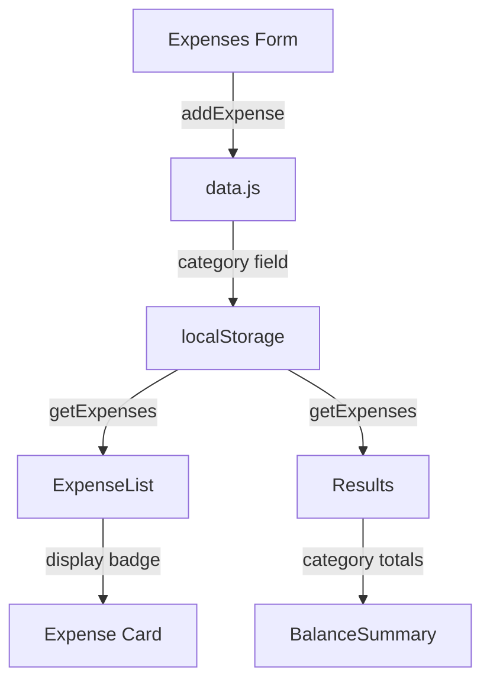

# Expense Categories - Implementation Plan

## Overview

Add optional categorization to expenses with filtering and category-based summaries in results.

---

## Data Model

### Categories Definition

Location: `src/utils/constants.js`

Add new constant:

```js
export const expenseCategories = [
  { id: 'food', label: 'Food', color: '#f59e0b', icon: '🍔' },
  { id: 'transport', label: 'Transport', color: '#3b82f6', icon: '🚗' },
  { id: 'accommodation', label: 'Accommodation', color: '#8b5cf6', icon: '🏨' },
  { id: 'entertainment', label: 'Entertainment', color: '#ec4899', icon: '🎬' },
  { id: 'shopping', label: 'Shopping', color: '#10b981', icon: '🛍️' },
  { id: 'other', label: 'Other', color: '#6b7280', icon: '📦' },
]
```

### Expense Object Update

Location: `src/data.js`

Modify `addExpense` and `updateExpense` to accept optional `category` field:

```js
const expense = {
  id: crypto.randomUUID(),
  name: name.trim(),
  amount: parseFloat(amount),
  category: category || null, // NEW FIELD
  paidBy,
  splitAmong,
  splits,
  createdAt: new Date().toISOString(),
}
```

---

## Phase 1: Core Implementation

### 1.1 Update Expenses Form

File: `src/components/Expenses/Expenses.jsx`

- Add state for selected category
- Add category selector (pill buttons or dropdown) above the form
- Pass category to `addExpense()` and `updateExpense()`

### 1.2 Update ExpenseList Display

File: `src/components/ExpenseList/ExpenseList.jsx`

- Display category badge with color and icon next to expense name
- Add helper to get category info by ID

### 1.3 Update Edit Flow

File: `src/components/Expenses/Expenses.jsx`

- When editing expense, pre-populate the selected category

---

## Phase 2: Results Enhancement

### 2.1 Add Category Summary

File: `src/components/BalanceSummary/BalanceSummary.jsx`

Add new section showing spending breakdown by category:

- Calculate totals per category
- Display as mini bar chart or list with percentages
- Only show if expenses have categories assigned

### 2.2 Update TransactionTable

File: `src/components/TransactionTable/TransactionTable.jsx`

- Add category column to the table
- Filter options by category

---

## Phase 3: Filtering (Optional Enhancement)

### 3.1 Add Filter UI

File: `src/components/ExpenseList/ExpenseList.jsx`

- Add filter dropdown above expense list
- Options: All, Food, Transport, etc.
- Filter displayed expenses based on selection

---

## Component Flow



---

## File Changes Summary

| File                                                   | Changes                                       |
| ------------------------------------------------------ | --------------------------------------------- |
| `src/utils/constants.js`                               | Add `expenseCategories` array                 |
| `src/data.js`                                          | Accept `category` in addExpense/updateExpense |
| `src/components/Expenses/Expenses.jsx`                 | Add category selector, pass to data functions |
| `src/components/ExpenseList/ExpenseList.jsx`           | Display category badge                        |
| `src/components/BalanceSummary/BalanceSummary.jsx`     | Add category breakdown section                |
| `src/components/TransactionTable/TransactionTable.jsx` | Optional: add category column                 |

---

## Backwards Compatibility

- Category is optional - existing expenses without category will still work
- Use `category || null` to handle missing field gracefully
- UI should show "No category" or hide badge when category is null
